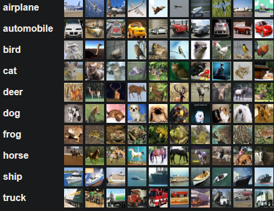

# CIFAR-10 Image Classification with Convolutional Neural Networks

In this project, we build and train a Convolutional Neural Network (CNN) to classify images from the CIFAR-10 dataset. The CIFAR-10 dataset consists of 60,000 32x32 color images in 10 different classes, with 6,000 images per class. We use TensorFlow and Keras to create our deep learning model.

## Table of Contents
- [Project Overview](#project-overview)
- [Dataset](#dataset)
- [Model Architecture](#model-architecture)
- [Training](#training)
- [Evaluation](#evaluation)
- [Results](#results)
- [Usage](#usage)
- [Contributing](#contributing)
- [License](#license)

## Project Overview

In this project, we:

- Load and preprocess the CIFAR-10 dataset.
- Build and compile a CNN model for image classification.
- Train the model using data augmentation techniques.
- Evaluate the model's performance using accuracy and other metrics.
- Display predictions, including a confusion matrix and label probabilities.
- Visualize training and validation accuracy.

## Dataset

The CIFAR-10 dataset contains images of 10 different classes, including 'airplane,' 'automobile,' 'bird,' 'cat,' 'deer,' 'dog,' 'frog,' 'horse,' 'ship,' and 'truck.' We load the dataset and visualize a sample image from each class.

## Model Architecture

Our CNN model architecture consists of multiple convolutional layers, batch normalization, max-pooling, dropout, and fully connected layers. We use the Adam optimizer and categorical cross-entropy loss for training.

## Training

We train the model using data augmentation techniques, including rotation, width and height shifting, and horizontal flipping. We specify the batch size, number of epochs, and monitor the training progress.

## Evaluation

After training, we evaluate the model's performance on the test dataset. We calculate the test accuracy, display predictions with label probabilities, and visualize a confusion matrix to understand classification performance.

## Results

Our trained model achieves an accuracy of XX% on the test dataset. We also calculate and display metrics such as F1 score, recall, and precision.

## Usage

You can use this project as a starting point for image classification tasks or as a reference for building and training CNN models with TensorFlow and Keras. Feel free to fork and modify the code to fit your specific needs.

## Contributing

Contributions are welcome! If you have any ideas, enhancements, or bug fixes, please open an issue or create a pull request.

## License

This project is licensed under the MIT License. See the [LICENSE](LICENSE) file for details.

---

[GitHub Repository](https://github.com/yourusername/your-repo)

